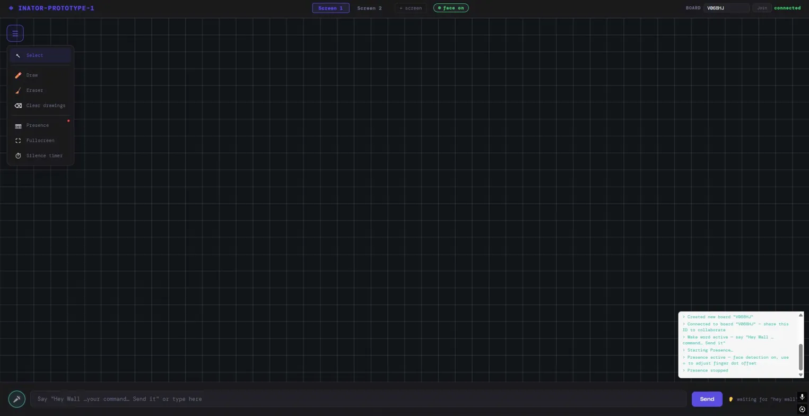
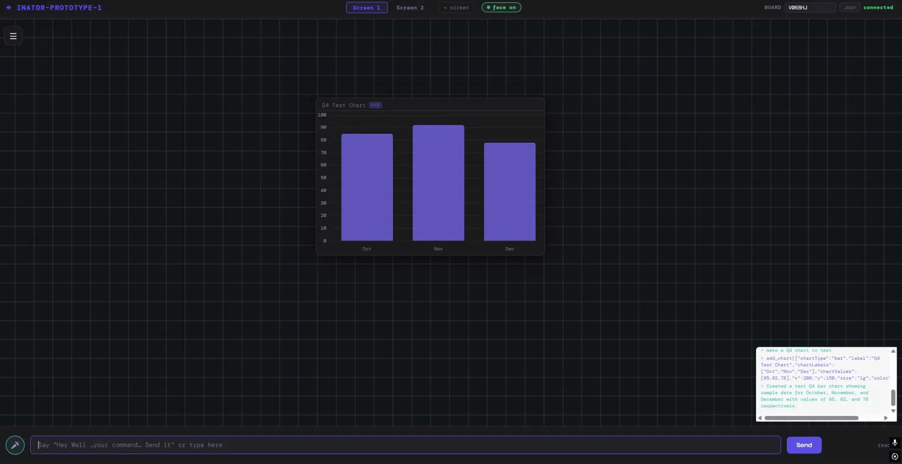

# Inator — The AI Meeting Room OS

> Built to make in-person meetings feel like the work version of Jarvis.




## What is it?

Inator is an ambient AI meeting room interface that makes the room itself intelligent. No clicking through menus, no switching apps, no fumbling with a projector remote. You talk to the room, point at the screen, and it responds.

Built for teams who want their in-person meetings to move as fast as their thinking.

## What it does

- **Voice commands** — say "Hey Wall..." to generate charts, pull up data, move elements, or control the workspace hands-free
- **AI-generated visualizations** — Claude generates charts and graphs on the spot from natural language requests, no spreadsheet needed
- **Finger tracking** — move visual elements between screens using hand gestures via MediaPipe, no mouse required
- **Face tracking** — presence detection so the room knows when people are engaged
- **Real-time collaboration** — teammates join via a shared board ID and can edit or spectate live via Supabase
- **Multi-screen support** — built for full meeting room environments with multiple displays

## Tech stack

| Layer | Technology |
|---|---|
| AI brain | Claude API (Anthropic) — tool use for visual element control |
| Gesture tracking | MediaPipe — finger and face detection |
| Real-time sync | Supabase — live collaboration and presence |
| Frontend | Vanilla HTML / CSS / JS — single file, zero framework |

## Why I built it

In-person meetings are still slow and clunky despite all the AI tools available. Someone always needs to share their screen. Charts take 10 minutes to build in Excel. Half the room can't see the laptop. 

I wanted to build something that made the room itself the interface — where the AI gets out of the way and lets people focus on thinking, not navigating software. The vision was a work version of Jarvis: ambient, responsive, and intelligent.

## How it works

1. Open the app on any screen in the room
2. Share the board ID with collaborators so they can join
3. Say "Hey Wall..." followed by any command — generate a chart, move an element, pull up data
4. Use finger tracking to drag visual elements between screens
5. Everything syncs in real time across all connected devices

## Architecture

```
Voice input → Wake word detection → Claude API (tool use)
                                         ↓
                              Tool calls: add_chart, move_element,
                                         update_data, clear_board
                                         ↓
                              Supabase real-time sync → all connected screens
                                         ↓
                              MediaPipe overlay → gesture control layer
```

## Status

Active development — voice commands, AI chart generation, finger tracking, face detection, and real-time collaboration are all live. Hosting and deployment in progress.

## What's next

- n8n integration for pluggable AI personalities and business tool connections
- Live data connectors (pull from Google Sheets, Notion, internal APIs)
- Persistent board history
- Mobile spectator mode

---

Built by Tobin | [GitHub](https://github.com/yourusername)
